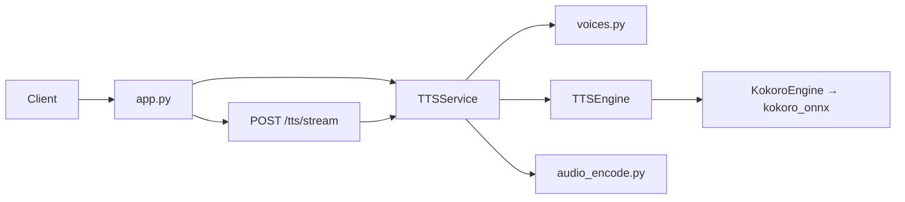

# 架构（ARCHITECTURE）

## 仓库布局

```
Sonus/
├── README.md
├── AGENTS.md
├── Dockerfile               # 多阶段镜像（模型不入镜）
├── docker-compose.yml       # 挂载 models/ + 缓存卷
├── scripts/download-models.sh
├── docs/                    # 产品 / 架构 / 路线 / 决策 / 开发日志
├── models/                  # 本地模型（.gitignore，README 说明下载）
├── pyproject.toml
└── src/sonus/
    ├── app.py               # FastAPI：/health、/voices、/tts、/tts/stream、/v1/audio/speech
    ├── config.py            # Settings（SONUS_*）
    ├── schemas.py           # TTSRequest、AudioFormat（对外 JSON 契约）
    ├── voices.py            # 逻辑音色 → 引擎 voice + phonemizer lang
    ├── service.py           # TTSService：编排 + 长文本切分 + 编码
    ├── text_split.py        # 长文本按标点/段落切分
    ├── cache.py             # 磁盘音频缓存
    ├── openai_compat.py     # OpenAI /v1/audio/speech 请求模型与 voice 映射
    ├── zh_g2p.py            # 中文 ZHG2P + 中英混排 en_callable
    ├── factory.py           # build_engine / build_tts_service
    ├── audio_encode.py      # float32 PCM → WAV / MP3
    ├── cli.py               # Typer：serve、tts
    └── engines/
        ├── base.py          # TTSEngine Protocol、SynthesisResult
        └── kokoro.py        # KokoroEngine（懒加载 Kokoro）
```

## 请求路径（HTTP）



1. **`app.py`**：解析 `TTSRequest`，依赖注入 `TTSService`；错误映射为 400 / 503 / 500。  
2. **`RequestLoggingMiddleware`**：分配/透传 **`X-Request-ID`**，记录请求耗时；`/tts` 另记 synthesis 摘要（不记录全文）。  
3. **`logging_config`**：`SONUS_LOG_LEVEL`、启动时打印引擎与模型文件就绪情况。  
4. **`TTSService`**：解析 voice；可选 **`AudioCache`**；`split_text` 切长文；逐段合成；`encode_audio` 或流式 PCM。  
5. **`KokoroEngine`**：首次合成前加载 ONNX + voices；中文走 misaki `ZHG2P`（可选 `en_callable` 混排英文）。  
6. **`audio_encode`**：WAV 用 `soundfile`；MP3 为 WAV → `pydub` → ffmpeg。

## 扩展新引擎（约定）

1. 在 `engines/` 实现与 `TTSEngine` 结构一致的类（`engine_id`、`synthesize`、`list_voices`）。  
2. 在 `factory.build_engine` 中按 `Settings.engine` 分支注册。  
3. 逻辑音色在 `voices.py` 中维护；若新引擎音色命名不同，**仅改映射与 factory**，HTTP 字段名不变。  
4. 更新 `docs/DECISIONS.md` 与本文「请求路径」小节。

## 配置模型

| 配置项 | 来源 | 说明 |
|--------|------|------|
| host / port | `SONUS_HOST` / `SONUS_PORT` | CLI `serve` 与文档示例 |
| log_level | `SONUS_LOG_LEVEL` | `debug` / `info` / `warning` / `error` / `critical` |
| max_chunk_chars | `SONUS_MAX_CHUNK_CHARS` | 长文本切分；`0` 禁用 |
| cache | `SONUS_CACHE_*` | 磁盘 hash 缓存；TTL 可选 |
| engine | `SONUS_ENGINE` | 当前仅 `kokoro` |
| zh_en_mixed | `SONUS_ZH_EN_MIXED` | 中文句内英文走 espeak G2P |
| 模型路径 | `SONUS_MODEL_PATH` / `SONUS_VOICES_PATH` | 相对路径相对**进程 cwd**，一般为项目根 |

## API 稳定性说明

- 客户端应依赖：**路径**（`/tts`）、**JSON 字段语义**（`format` 为请求体别名，对应 `audio_format`）。  
- OpenAI 兼容：**`POST /v1/audio/speech`**（字段 `input` / `model` / `voice` / `response_format`）；与 `/tts` 并存，不破坏现有客户端。  
- OpenAPI 文档由 FastAPI 自动生成（`/docs`）。
