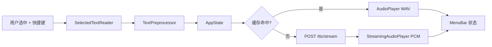

# Sonus Companion 架构

## 定位

**Sonus Companion** 是 macOS 菜单栏客户端，负责：

1. 捕获任意 App 中的选中文本  
2. （可选）按 **Text Rules** 预处理文本 — 见 [TEXT_RULES.md](TEXT_RULES.md)  
3. 调用本地 Sonus HTTP 服务合成语音  
4. 播放并管理播放状态  

与 Python TTS 后端解耦：Companion 只依赖稳定 HTTP 契约（当前为 `/tts`、`/voices`、`/health`）。

## 仓库位置

```
Sonus/
├── src/sonus/           # TTS 后端（FastAPI）
└── SonusCompanion/      # macOS 菜单栏 App（Swift / SwiftUI）
```

## 数据流



（`TextPreprocessor` 已实现；总开关关闭时 bypass，数据流与现网一致。）

## 模块

| 模块 | 职责 |
|------|------|
| `SonusCompanionApp` | MenuBarExtra + Settings scene |
| `AppState` | 状态机、speak/stop、设置持久化 |
| `SelectedTextReader` | AX 选中文本 → 剪贴板 fallback |
| `SonusClient` | `/health`、`/voices`、`/tts/stream`（主路径）、`/tts`（备用） |
| `AudioPlayer` | 缓存命中时 WAV 文件播放 |
| `StreamingAudioPlayer` | 流式 PCM 播放（`AVAudioEngine`） |
| `HotkeyManager` | Carbon 全局热键 |
| `LaunchAtLoginManager` | `SMAppService.mainApp` 登录自启 |
| `TextRuleStore` / `TextPreprocessor` | 文本规则持久化与 TTS 前 pipeline（见 [TEXT_RULES.md](TEXT_RULES.md)） |

## API 适配

后端 `GET /voices` 返回：

```json
{
  "engine": "kokoro",
  "logical": { "zh_female": { "engine_voice": "zf_001", "lang": "cmn" } },
  "native": ["af_bella", "..."]
}
```

Companion 将 `logical` 映射为 UI 列表 `{ id, name, language }`。

**缓存未命中**（主路径）— `POST /tts/stream`：

```json
{ "text": "...", "voice": "zh_female", "speed": 1.0 }
```

响应：HTTP chunked，`audio/L16; rate=24000; channels=1`（16-bit mono PCM）。首包到达即开始播放。

**缓存命中** — 直接播放本地 WAV（由流式 PCM 封装或历史 `/tts` 缓存）。

`POST /tts` 请求体（备用 / 历史）：

```json
{
  "text": "...",
  "voice": "zh_female",
  "speed": 1.0,
  "format": "wav"
}
```

## 权限

- **Accessibility**：读取 `kAXSelectedTextAttribute`、模拟 Cmd+C  
- **Notifications**：错误提示（可选）  
- **未启用 App Sandbox**（全局热键与 AX 需要）

## 本地路径

| 用途 | 路径 |
|------|------|
| 日志 | `~/Library/Logs/Sonus/sonus.log` |
| 音频缓存 | `~/Library/Caches/Sonus/audio/` |
| 文本规则 | `~/Library/Application Support/Sonus/text-rules.json` |

## 联调

```bash
uv run sonus serve
curl -sS http://127.0.0.1:8000/health
```

然后运行 Companion，在 Safari / Preview 等 App 选中文本，按 **⌥Esc**。

## 后续

- ~~流式播放（对接 `POST /tts/stream`）~~（已完成）  
- ~~登录自启~~（已完成）  
- ~~**文本预处理（Text Rules）**~~（已完成 — [TEXT_RULES.md](TEXT_RULES.md)）
