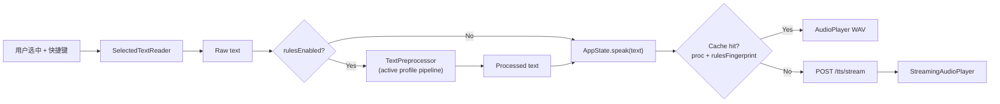

# Companion 文本预处理（Text Rules）

> **状态**：已实现（Companion Settings + 菜单栏 Profile 切换；`SonusCompanionTests` 覆盖预处理与持久化）。

## 目标

用户在 PDF / MarginNote / Preview 等 App 中选中一段文字并通过 Companion 朗读时，**不要**把引用编号、作者索引、图表编号等「阅读噪声」原样念出。  
在发送到 Sonus HTTP `/tts` / `/tts/stream` **之前**，用一组可自定义规则（正则或字面量查找替换）净化文本。

## 非目标（MVP）

- Python 服务端 `/tts` 不做文本预处理（API 仍只接收最终 `text`）
- 按前台 App 自动切换 Profile
- 「Skip rules once」临时绕开、第二热键读原文
- Preview 区一键 TTS 试读
- 单条规则逐步 diff 调试 UI

## 产品决策摘要

| 议题 | 决策 |
|------|------|
| 放置位置 | **Companion 本地执行**；规则仅在 Companion Settings 管理；Python Phase 2 可选复用同一 JSON schema |
| 规则能力 | 字面量 / 正则、捕获组 `$1`、替换为固定朗读词或空串（删除） |
| 预设 | 内置 **Paper Reading** 预设 + 空 **General**；可逐条开关、编辑、删除；可恢复 Paper 内置默认 |
| 应用顺序 | 当前 Profile 内**已启用规则**按列表顺序 pipeline；Settings 可拖拽排序 |
| 总开关 | Settings **Enable text rules**；关 = 始终读原文 |
| 持久化 | `~/Library/Application Support/SonusCompanion/text-rules.json`；Import / Export JSON |
| 预览 | Sample 文本 + **Preview** 显示处理后全文；可选 **Use last selection** |
| 音频缓存 | Key 含**处理后文本** + voice + speed + **规则指纹** |
| Profile | 多 Profile（Paper / General / Custom）；Settings 与菜单栏切换当前 Profile |
| MVP 范围 | Companion 全功能；服务端不改 |

详见 [DECISIONS.md — 015](DECISIONS.md#015--companion-文本预处理在客户端执行)。

## 数据流



**插入点**：`AppState.speakSelection()` 在 `readSelectedText()` 成功之后、`speak(text:)` 之前。

当前实现（无预处理）见 [COMPANION.md](COMPANION.md)。

## 模块（Companion）

| 模块 | 职责 |
|------|------|
| `TextRule` | 单条规则：id、name、enabled、isRegex、pattern、replacement、builtIn |
| `TextRuleProfile` | Profile：id、name、builtIn、rules[] |
| `TextRuleStore` | 读写 JSON、Import/Export、恢复内置预设、activeProfileId |
| `TextPreprocessor` | 对字符串按 Profile 内 enabled 规则顺序依次替换 |
| `TextRulesSettingsView` | Settings → Text Rules：总开关、Profile、CRUD、排序、Preview |
| `AppState` | 调用预处理；空结果校验；缓存 key 传入 rulesFingerprint |

## 配置文件

**路径**：`~/Library/Application Support/SonusCompanion/text-rules.json`

**Schema（version 1）**：

```json
{
  "version": 1,
  "rulesEnabled": true,
  "activeProfileId": "paper",
  "profiles": [
    {
      "id": "paper",
      "name": "Paper Reading",
      "builtIn": true,
      "rules": [
        {
          "id": "bracket-citations",
          "name": "Bracket citations",
          "enabled": true,
          "isRegex": true,
          "pattern": "\\[\\d+(?:,\\s*\\d+)*\\]",
          "replacement": "",
          "builtIn": true
        }
      ]
    },
    {
      "id": "general",
      "name": "General",
      "builtIn": true,
      "rules": []
    }
  ]
}
```

**规则指纹（`rulesFingerprint`）**：对当前 Profile 下所有 `enabled: true` 的规则，按列表顺序串联  
`id|pattern|replacement|isRegex`，做 SHA256 十六进制摘要。  
总开关关闭时使用固定值 `noop`。

**缓存 key**（扩展现有 `AudioPlayer.cacheFileURL`）：

```
SHA256(processedText | voice | speed | format | rulesFingerprint)
```

## 预处理语义

1. 若 `rulesEnabled == false` 或当前 Profile 无 enabled 规则 → 返回原文，`rulesFingerprint = noop`。
2. 否则按 Profile 内 rules **数组顺序**，对每条 `enabled` 规则：
   - `isRegex == false`：字面量全局替换（Swift `replacingOccurrences`）
   - `isRegex == true`：NSRegularExpression 全局替换；replacement 支持 `$1`… 捕获组
3. 单条 pattern 非法 → **跳过该条**，写日志 `text rule skipped: <name> <error>`，不阻断 TTS。
4. 最终结果 `trim` 后若为空 → 提示 **No speakable text after rules**，不发起 HTTP。

## 内置 Paper 预设（初版）

实现时写入 `TextRuleStore` 默认值；上线前用真实 MarginNote / PDF 选区微调。

| id | name | pattern | replacement | 默认 enabled |
|----|------|---------|-------------|--------------|
| `bracket-citations` | Bracket citations | `\[\d+(?:,\s*\d+)*\]` | `` | 是 |
| `superscript-citations` | Superscript citations | `\^\d+` | `` | 是 |
| `author-year` | Author-year parenthetical | `\([A-Z][A-Za-z\-]+(?:\s+et\s+al\.)?,\s*\d{4}[a-z]?\)` | `` | 是 |
| `et-al` | et al. | `\bet\s+al\.` | `等人` | 否 |
| `figure-ref` | Figure reference | `\bFig(?:ure)?\.?\s*\d+[a-z]?` | `` | 是 |
| `table-ref` | Table reference | `\bTab(?:le)?\.?\s*\d+` | `` | 是 |
| `collapse-space` | Collapse whitespace | `\s{2,}` | ` ` | 是（放列表末尾） |

**General** Profile：`rules: []`，用于读非论文内容（配合总开关或 Profile 切换；与关闭 text rules 效果相同，但便于菜单栏一键切回 Paper）。

用户可在 Settings 中自建 **Custom** Profile（`builtIn: false`）。

## Settings UI

**位置**：Settings → **Text Rules**（独立 Section 或子窗口，规则多时考虑加宽窗口）。

| 控件 | 行为 |
|------|------|
| Enable text rules | 总开关，持久化到 JSON |
| Active profile | Picker：Paper / General / Custom… |
| 规则列表 | 名称、enabled Toggle、pattern、replacement、Regex Toggle；拖拽排序 |
| Add rule | 新建用户规则（`builtIn: false`） |
| Restore built-in defaults | 仅重置当前 Profile 的内置规则为出厂默认 |
| Sample text | 多行文本框；按钮 **Use last selection** 填入最近一次选区 |
| Preview | 显示当前 Profile + enabled 规则处理后的全文 |
| Import… / Export… | JSON 文件 picker；**Import 整文件替换**当前配置 |

**菜单栏**（可选同期或紧随其后）：

- 状态行：`Rules: On · Paper` 或 `Rules: Off`
- 子菜单：切换 Active profile

## 日志

写入 `~/Library/Logs/SonusCompanion/sonus-companion.log`：

```
preprocess profile=paper rules=5 raw_len=420 proc_len=380 fingerprint=abc123...
text rule skipped: bad-pattern Invalid regular expression
```

不记录完整选区正文（与 HTTP 侧不记全文一致）；可记长度与 fingerprint。

## Phase 2（暂不实现）

- Python `sonus` 读取同路径 JSON 或 `~/.config/sonus/text-rules.json`，在 `TTSService` 前预处理（CLI 复用）
- `POST /tts` 可选字段 `apply_text_rules: true`（破坏最小 API 时需 DECISIONS 条目）
- Preview TTS、按 App 自动 Profile、规则逐步调试

Companion 保持**唯一配置入口**。

## 实现顺序

1. `TextPreprocessor` + 单元测试（Swift Testing 或 XCTest）
2. `TextRuleStore` + 内置 Paper/General Profile + 默认 JSON 迁移
3. `AppState.speakSelection()` 接入 + 缓存 fingerprint
4. `TextRulesSettingsView`（CRUD、Preview、Import/Export）
5. Profile 切换 + 菜单栏状态
6. 真机回归：MarginNote / Preview / Safari 选区

## 风险

| 风险 | 缓解 |
|------|------|
| 引用格式因期刊/复制源差异大 | 预设 + 用户自定义；Preview + last selection |
| 规则过 aggressive 删掉正文 | 保守默认；先替换短语再删除；General Profile |
| Settings 复杂度 | Profile 分场景；Paper 默认即可用 |
| 改规则后播旧缓存 | rulesFingerprint 纳入 cache key |

## 相关文档

- [COMPANION.md](COMPANION.md) — Companion 整体架构
- [ROADMAP.md](ROADMAP.md) — 下一优先级
- [DECISIONS.md — 015](DECISIONS.md#015--companion-文本预处理在客户端执行)
